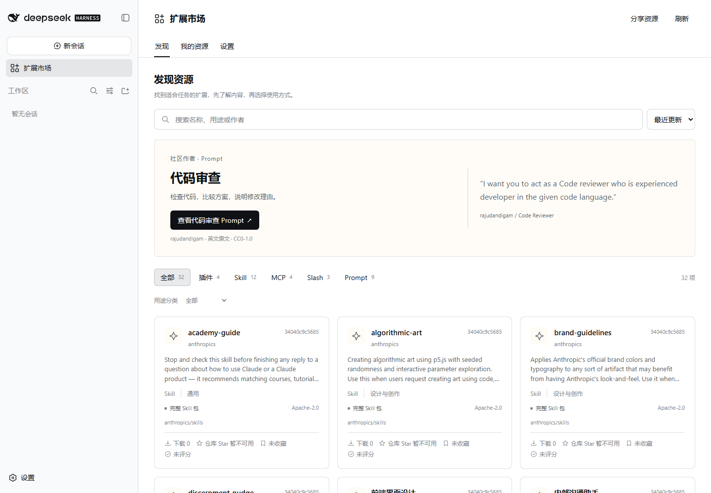

# DSH Marketplace

[English](../../README.md) · [简体中文](README.zh-CN.md) · [日本語](README.ja-JP.md)

在 **DeepSeek Harness 内发现、使用和管理插件、Skill、MCP、Slash、Prompt 与主题**。独立维护的社区项目，支持中、英、日三语界面，无需注册市场账号。

[下载版本](https://github.com/QT7-C23/DSH-Marketplace/releases) · [使用文档](../README.md) · [参与贡献](../../CONTRIBUTING.md)



*开发界面截图；资源文档保留作者原文。*

## 可以做什么

| 资源 | 在 DSH 中使用 |
|---|---|
| 插件 | 检查兼容性，通过受支持的宿主接口安装、更新、启停和卸载。 |
| Skill | 安装经过校验的原始文件，加载、更新、停用和恢复受管理的版本。 |
| MCP | 配置 HTTPS Streamable HTTP 或固定 npm 版本的 stdio 服务，支持启停和移除。 |
| Slash | 执行插件在当前会话中提供的命令。 |
| Prompt | 预览并追加到草稿，保留已有文字、引用和附件，不自动发送。 |
| 主题 | 发现和管理 npm 主题包，展示具体资源的兼容情况。 |

接入固定 DSH 目录、Anthropic Skills、OpenAI Skills、npm、MCP Registry 和本项目审核后的 GitHub 目录。自动发现每六小时检查一次，刷新不完整时保留旧目录。被发现不代表每项资源都能运行。[来源说明](../../sources/README.md)

可按可用语言阅读作者原始文档。翻译需主动选择 DSH 模型并开始，会消耗所选模型的 Token；失败或取消也可能计费。

## 快速开始

**当前预发布：[v0.2.0-alpha.1](https://github.com/QT7-C23/DSH-Marketplace/releases/tag/v0.2.0-alpha.1)。** 实测环境为 Windows、Node.js 24、DSH 0.1.5-rc.2。安装需要 PATH 中可用的 pnpm 和 npm 网络。

从发布页下载 TGZ 与 `SHA256SUMS.txt`，校验后停止 DSH，再安装：

```powershell
dsh plugin --profile web add "C:\Downloads\dsh-market-integration-0.2.0-alpha.1.tgz" --ignore-scripts --registry=https://registry.npmjs.org
dsh web
```

从侧栏进入“扩展市场”，在设置中切换语言。浏览无需模型密钥。更新和卸载见[安装指南](../PACKAGE_INSTALLATION.md)，源码运行见[开发指南](../../integration/README.md)。市场尚未发布到 npm。

## 使用前须知

- **兼容性**：分别支持原生 DSH 资源和受支持的 dsh-std 组件。标准组件变更需要完整重启；固定适配器存在 CommandRuntime 组合问题。见[兼容与主题](../COMPATIBILITY_AND_THEMES.md)。
- **资源管理**：MCP 换版或改配置需先移除再连接。市场曾管理标准组件时，卸载前先完成[卸载准备](../PACKAGE_INSTALLATION.md#标准组件卸载准备)。
- **GitHub 连接**：可选读取令牌用于改善 API 额度；Windows 首次初始化凭据可能等待约一分钟。见[连接说明](../GITHUB_CONNECTION.md)。
- **统计与数据**：Star 属于来源仓库，npm 下载量属于整个包，本机下载量统计成功准备文件的次数。收藏与评分是浏览器个人数据，清理站点数据会删除它们。

当前为早期预发布；其他宿主版本及所有第三方组合尚未获得验证，不提供自动恢复，本地模型下载暂不在范围内。

## 参与贡献

按[贡献指南](../../CONTRIBUTING.md)提交问题或资源提案，经 GitHub 审核收录。作者和权利人无需提出侵权指控，即可提交[撤下申请](https://github.com/QT7-C23/DSH-Marketplace/issues/new?template=04-resource-removal.yml)；既有私人副本和安装会保留。

开发入口：[启动与验证](../../integration/README.md) · [架构](../ARCHITECTURE.md) · [仓库规范](../../AGENTS.md) · [CI](https://github.com/QT7-C23/DSH-Marketplace/actions)。统一验证命令为 `npm run verify`。

## 许可与声明

原创代码与文档采用 **[MIT](../../LICENSE)**，© 2026 QT7-C23 and contributors。第三方内容保留各自许可和署名，见[第三方版权声明](../../THIRD_PARTY_NOTICES.md)。

本项目独立维护，不表示 DeepSeek 官方隶属或背书；名称和商标属于各自权利人。软件**按现状提供，不附带保证**，详见[中、英、日免责声明](../../DISCLAIMER.md)。
