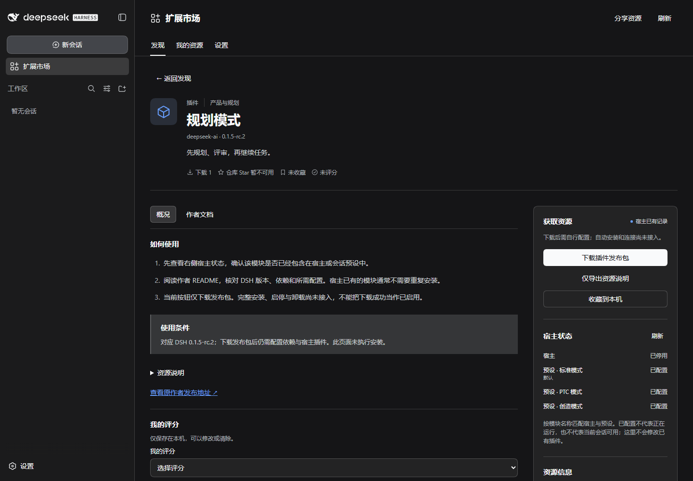

# 资源信息、宿主状态与官方安装路线

日期：2026-09-14。对应产品需求 R30、R31；插件安装、启用、卸载的原有目标继续保留，尚未完成。

## 参考与差距

- [Awesome DSH Plugin](https://github.com/awesome-dsh-plugin/awesome-dsh-plugin/tree/d9a53bf020be61f21eb9a55f5a12ae7e49bf3d61)：本轮读取公开目录结构与 README，确认其要求社区提交带 `dsh.bundle` 的包。采用作者署名、分类和安装资格分开的信息组织。
- [dsh-market](https://github.com/dsh-market/dsh-market/tree/92b4caf614e07f54b47f40ec36cd6a5cf683e42d)：读取 README、安装/配置相关源码和前端组件。其资料包含兼容要求、安装进度、激活结果、收藏和截图；这些是当前市场应补齐的信息层级。
- 本轮浏览器连接失败，未实际操作上述产品的运行页面，也未独立验证它们的全部功能。没有复制竞品源码或图片；下面的截图和行为验证只属于本仓库的实际 DSH 集成。

| 差距 | 本轮结果 | 仍待完成 |
|---|---|---|
| 卡片不足以判断资源 | 版本、许可、来源、使用方式、分类计数；统计独立展示 | 社区 bundle 和更多资源覆盖 |
| 详情缺少行动依据 | 五类使用步骤、完整摘要、README、资源信息与宿主状态 | 真正安装、连接与启停 |
| 配置状态被误当作运行状态 | 宿主/预设逐项显示已配置、加载中、已加载、卸载中、停用、失败或条件启用 | 当前会话的可调用性验证 |
| 页面视觉较平 | 有边界的两/三列卡片、类型图标、搜索、原有暖底横幅 | 作者资源截图的规范与接入 |
| 浏览位置和窄屏 | 打开详情回到标题；390px 单列，获取区先于长正文 | 独立移动端产品验证 |

## 接口与安装决策

`PluginAvailability` 经 `PluginInventoryPort` 读取公开 Loader 和 AgentPresets API。只返回匹配目录模块的状态，不返回配置、路径或表达式；Slash 继承父插件记录。接口仅允许 GET，读取失败返回 503，前端清除旧状态并提供重试。没有把 npm 下载量、收藏、目录中的 bundle 文件描述当作实际安装证据。

实际宿主中，规划模块在宿主行是停用，在三个预设行是已配置；在无会话状态下不能把它们标成已加载。新增宿主验证同时比较页面与实际 API，并检查配置文件原文未变。

正式流程采用官方 `dsh plugin --profile <name> add/remove`，不自建依赖安装器或直接改 Loader 内部状态。商城自身仍是本地路径挂载，只有前端声明；还需整理完整发布包及 bundle 配置。当前四项官方模块不等于四个独立社区安装包。具体顺序和验收见 [官方安装方案](../OFFICIAL_PLUGIN_INSTALLATION.md)。

## 验证记录

- 新增回归首先因实现文件缺失而失败；实现后 4 项接口/合同测试通过，覆盖各 Fiber 阶段、预设未挂载、损坏预设、异常、数据投影与禁止写入。
- 新增 2 项实际宿主浏览器测试通过，证据 `artifacts/dsh-integration/verify-1JeFzq/`。初次窄屏实验仍展开宿主侧栏，市场实际可用宽度只有约 110px；按既有移动验收先收起侧栏，在真实 390px 内容区重测通过。
- `npm run verify` 的静态、62 项基础测试、11 项文档/翻译/状态测试、TypeScript 和构建通过。全量宿主运行 `verify-FWngw3` 遇到 GitHub HTTP 403：Skill 发现和作者 README 读取未通过，累计等待触发已有 120 秒进程上限。因此本轮尚不能宣称全量验证通过。
- 单独通过相同 Node 网络路径读取 GitHub rate limit，确认匿名额度 `remaining: 0`，重置时间 `2026-09-13T23:55:50Z`。未使用对话中出现过的凭据，也未改变网络路径规避限额。源目录正确保留上次缓存，文档显示失败与重试。
- 后续尝试中，Skill ZIP 的上游文件获取也出现超时；没有修改下载校验或放宽验收。最终代码再次通过 4 项状态合同测试、三语字典检查、类型与构建，新增 2 项宿主验收再次通过，最新证据 `artifacts/dsh-integration/verify-J4Kzqa/`。
- 使用明确的正向名称清单补跑 13 项宿主流程，`verify-h8OMOl` 中 12 项通过（包括样式、三语状态、Prompt 草稿/引用/附件及市场停用重载）。剩余翻译取消流程已确认中止到达宿主，但在切换资源后读取规划 README 时超时；该整项仍记为失败。文档、JSON、UTF-8 和链接的最终检查通过，未将局部通过改写成全量绿色。

运行捕获、API 快照与基线备份位于忽略的 `artifacts/plugin-lifecycle/` 和 `artifacts/dsh-integration/`；不包含在发布文件中。
